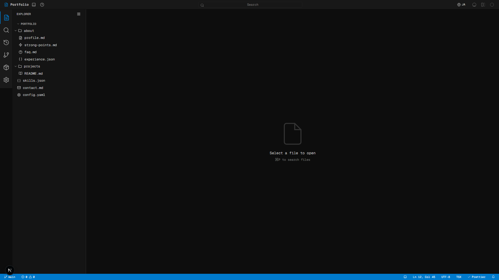
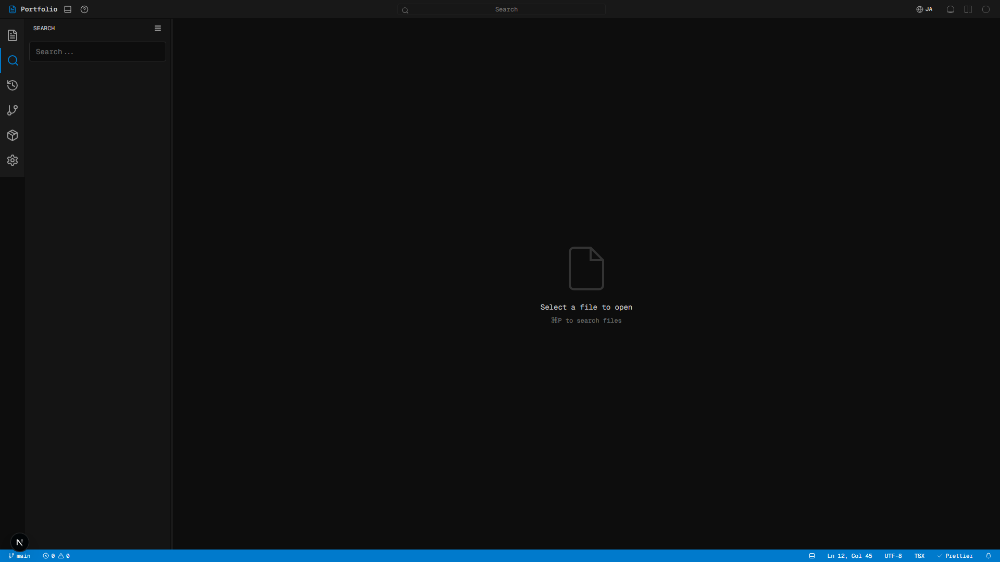
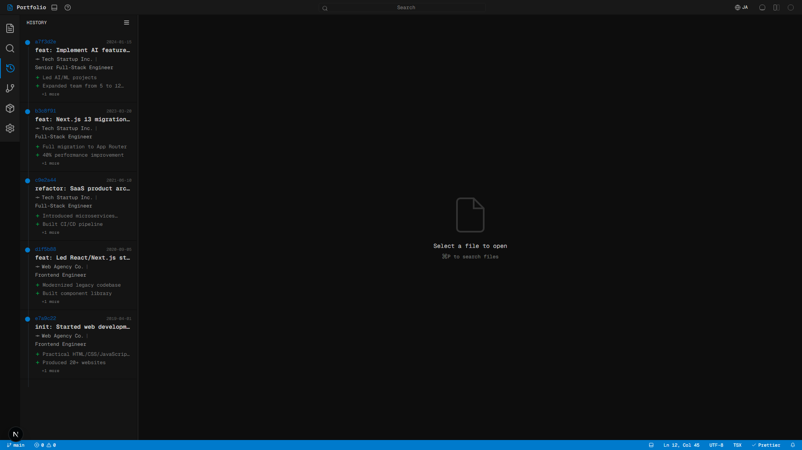
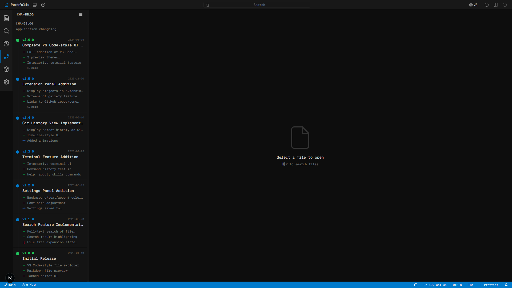
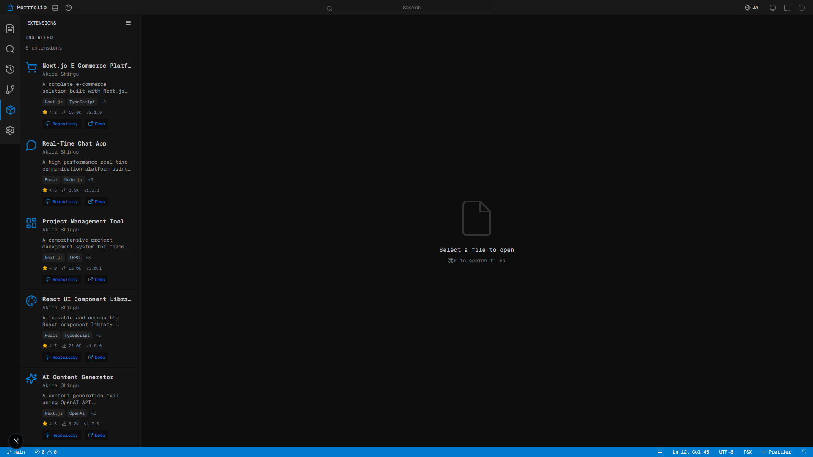
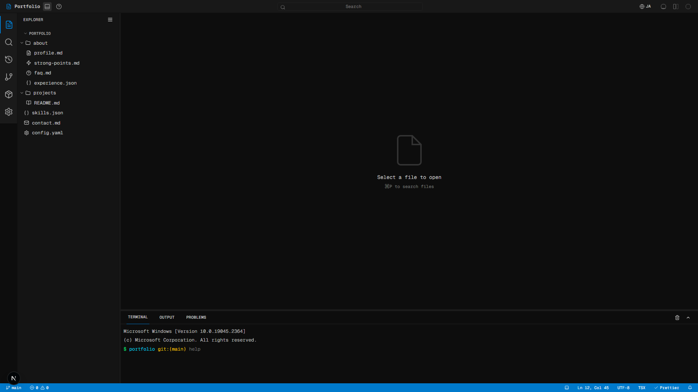
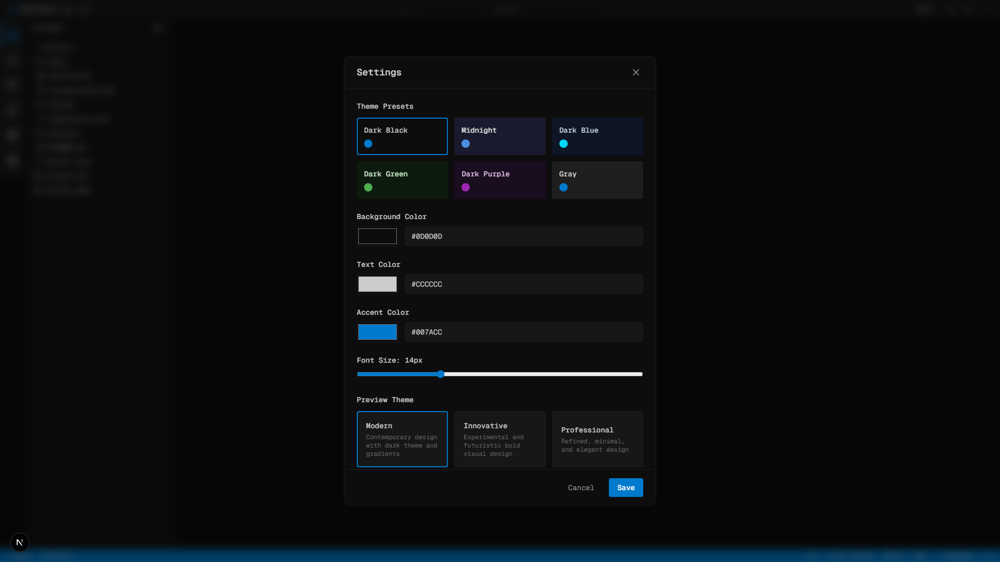
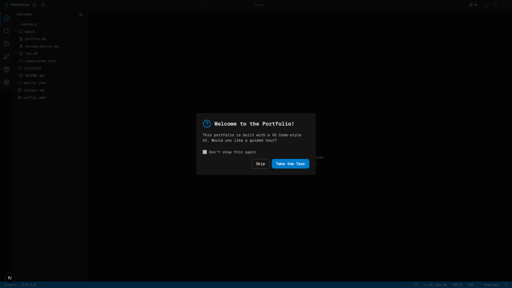

**日本語版は [README.ja.md](README.ja.md) をご覧ください。**

# VSCode Portfolio

A portfolio website that replicates the Visual Studio Code editor interface. Browse portfolio sections as if they were files in an IDE — complete with tabs, sidebar, terminal, settings panel, and theme customization.

## Features

- **VS Code UI**: Faithful recreation of VS Code with title bar, activity bar, sidebar, tabs, terminal, and status bar
- **3 Theme Variants**: Each portfolio section has Modern, Innovative, and Professional visual styles
- **8 Portfolio Sections**: Profile, Projects, Skills, Contact, Strong Points, FAQ, Experience, README
- **Bilingual**: Full Japanese and English support (next-intl)
- **Interactive Elements**: File explorer, search, git history, extension gallery, settings panel, tutorial overlay
- **Responsive**: Desktop, mobile landscape (with `short:` variant scaling), and portrait layouts
- **Visual Regression Testing**: 184 Playwright snapshot tests (168 section + 16 feature screenshots)
- **SSG Optimized**: Screenshot routes pre-rendered as static HTML at build time

## Sections & Themes

Each section is available in 3 visual themes: **Modern**, **Innovative**, and **Professional**.

### Profile

| Modern                                                             | Innovative                                                                 | Professional                                                                   |
| ------------------------------------------------------------------ | -------------------------------------------------------------------------- | ------------------------------------------------------------------------------ |
|  |  |  |

### Projects

| Modern                                                               | Innovative                                                                   | Professional                                                                     |
| -------------------------------------------------------------------- | ---------------------------------------------------------------------------- | -------------------------------------------------------------------------------- |
|  |  |  |

### Skills

| Modern                                                           | Innovative                                                               | Professional                                                                 |
| ---------------------------------------------------------------- | ------------------------------------------------------------------------ | ---------------------------------------------------------------------------- |
|  |  |  |

### Experience

| Modern                                                                   | Innovative                                                                       | Professional                                                                         |
| ------------------------------------------------------------------------ | -------------------------------------------------------------------------------- | ------------------------------------------------------------------------------------ |
|  |  |  |

### Strong Points

| Modern                                                                         | Innovative                                                                             | Professional                                                                               |
| ------------------------------------------------------------------------------ | -------------------------------------------------------------------------------------- | ------------------------------------------------------------------------------------------ |
|  |  |  |

### Contact

| Modern                                                             | Innovative                                                                 | Professional                                                                   |
| ------------------------------------------------------------------ | -------------------------------------------------------------------------- | ------------------------------------------------------------------------------ |
|  |  |  |

### FAQ

| Modern                                                     | Innovative                                                         | Professional                                                           |
| ---------------------------------------------------------- | ------------------------------------------------------------------ | ---------------------------------------------------------------------- |
|  |  |  |

## Interactive Features

The VS Code UI includes fully interactive elements beyond the portfolio sections.

| Explorer | Search |
| -------- | ------ |
|  |  |

| Git History | Changelog |
| ----------- | --------- |
|  |  |

| Extensions | Terminal |
| ---------- | -------- |
|  |  |

| Settings | Tutorial |
| -------- | -------- |
|  |  |

## Tech Stack

- **Framework**: Next.js 16 (App Router), React 19, TypeScript (strict)
- **Styling**: Tailwind CSS v4, custom `short:` variant for mobile landscape
- **i18n**: next-intl (ja/en)
- **Icons**: lucide-react
- **Testing**: Playwright (visual regression with `toHaveScreenshot`)
- **Linting**: ESLint 9, oxfmt, knip
- **Analytics**: Vercel Analytics
- **Deployment**: Vercel

## Getting Started

### Prerequisites

- Node.js 20+
- npm

### Install

```bash
npm install
```

### Development

```bash
npm run dev
```

Open [http://localhost:3000](http://localhost:3000).

### Build

```bash
npm run build
npm run start
```

Build output shows SSG status:

- `○ (Static)` — pre-rendered as static content
- `● (SSG)` — pre-rendered with `generateStaticParams`
- `ƒ (Dynamic)` — server-rendered on demand

### Quality Checks

```bash
# All checks at once (TypeScript + format + lint)
npm run check

# Individual
npm run type-check    # TypeScript type checking
npm run format        # oxfmt formatter
npm run lint:fix      # ESLint with auto-fix
npx knip              # Detect unused code/dependencies
```

### Visual Regression Testing

```bash
# Run all 184 snapshot tests
npx playwright test

# Run specific viewport/locale
npx playwright test -g "desktop ja/profile"

# Update baselines after intentional changes
npx playwright test --update-snapshots

# Generate HTML report for failures
npx playwright test --reporter=html
npx playwright show-report
```

Snapshots are stored in `e2e/__snapshots__/{locale}/{viewport}/{section}-{theme}.png`.

## Project Structure

```
app/
  [locale]/
    page.tsx                    # Main VS Code layout (client-rendered)
    layout.tsx                  # Locale layout with SEO metadata
    screenshot/[section]/[theme]/
      page.tsx                  # SSG screenshot pages (42 static routes)
  robots.ts                     # /robots.txt
  sitemap.ts                    # /sitemap.xml

components/
  vscode-layout.tsx             # Main layout shell
  vscode/                       # VS Code chrome (title-bar, activity-bar, tab-bar, status-bar, settings)
  sidebar/                      # Explorer, search, git-history, changelog, extensions panels
  preview/
    preview-panel.tsx           # Section dispatcher
    sections/<feature>/<theme>.tsx  # 24 section components (8 features × 3 themes)
  career-timeline/              # Experience section with shared timeline styles
  editor/                       # Editor area and empty state

constants/                      # All static data (portfolio, career, preview, config, tutorial)
contexts/                       # ThemeContext, LocaleContext
hooks/                          # use-settings, use-tabs, use-file-search, use-responsive
lib/                            # Utilities (color, file, icons)
i18n/                           # next-intl routing and request config
e2e/                            # Playwright visual regression tests + snapshots
```
